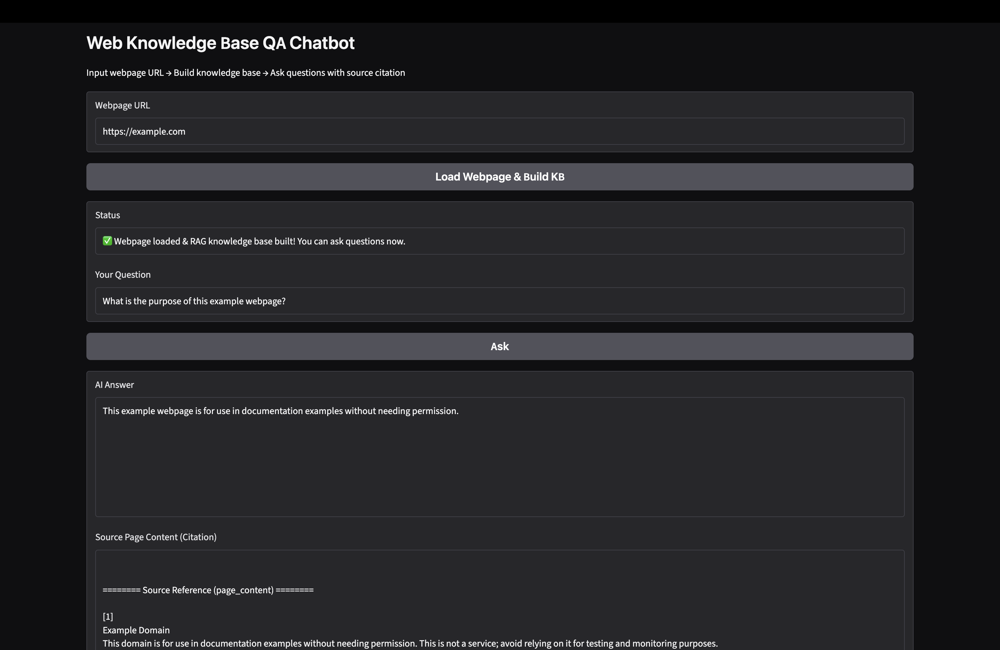

# Web Knowledge Base QA Chatbot
A RAG chatbot that ingests static web pages from URL, extracts webpage content via a custom web crawler, builds a vector knowledge base, and answers questions with source citations.

## ✨ Features
- Input any static webpage URL, crawl and extract clean article content (custom BeautifulSoup scraper, not off-the-shelf loader)
- Text chunking, embedding and vector storage with FAISS local vector database
- Question answering strictly grounded on the ingested webpage context
- **Source citation support**: return original `page_content` from retrieved chunks for RAG traceability and hallucination mitigation
- Simple Gradio web UI for live interaction
- Fully local execution powered by Ollama; no OpenAI API key required for local demo

## 🛠 Tech Stack
- Python 3.11
- LangChain (LCEL)
- BeautifulSoup4 & Requests: custom web crawler
- FAISS: local vector store
- Ollama: local LLM + embedding model
- Gradio: web frontend UI

## 📋 Prerequisites
1. Install [Ollama](https://ollama.com/)
2. Pull required models from your terminal:
```bash
ollama pull nomic-embed-text
ollama pull llama3.2
```

3. Create and activate conda environment

```
conda create -n webrag python=3.11
conda activate webrag
```

## 🚀 Installation

Install all dependencies:

```
pip install -r requirements.txt
```

## ▶ Run locally

```
python main.py
```

Open browser and visit: `http://127.0.0.1:7860`

### Demo Usage Guide

1. Paste a static webpage URL into the input box (recommended test link: `https://example.com`)
2. Click `Load Webpage & Build KB` to crawl webpage content and build vector knowledge base
3. Enter your question and click `Ask`
4. Review AI-generated answer and original source `page_content` for reference

## 📸 Demo Screenshot


## ⚠️ Limitations

- Only supports **static HTML web pages**. Dynamic JS-rendered SPA pages cannot be extracted by BeautifulSoup.
- Some websites have anti-scraping protection and may block HTTP requests.
- Cannot scrape pages with login requirements or paywalls.

## 📁 Project Structure

```
web-rag-chatbot/
├── main.py            # Gradio UI entry
├── web_crawler.py     # Custom BeautifulSoup web scraper
├── rag_pipeline.py    # RAG pipeline with source retrieval
├── requirements.txt
└── README.md
```

## 📌 Future Extensions

- Batch ingestion for multiple URLs
- Integrate Selenium/Playwright to scrape JS-rendered dynamic pages
- Add text chunk deduplication logic
- Deploy live demo on HuggingFace Spaces (requires switching to OpenAI embedding & LLM)
